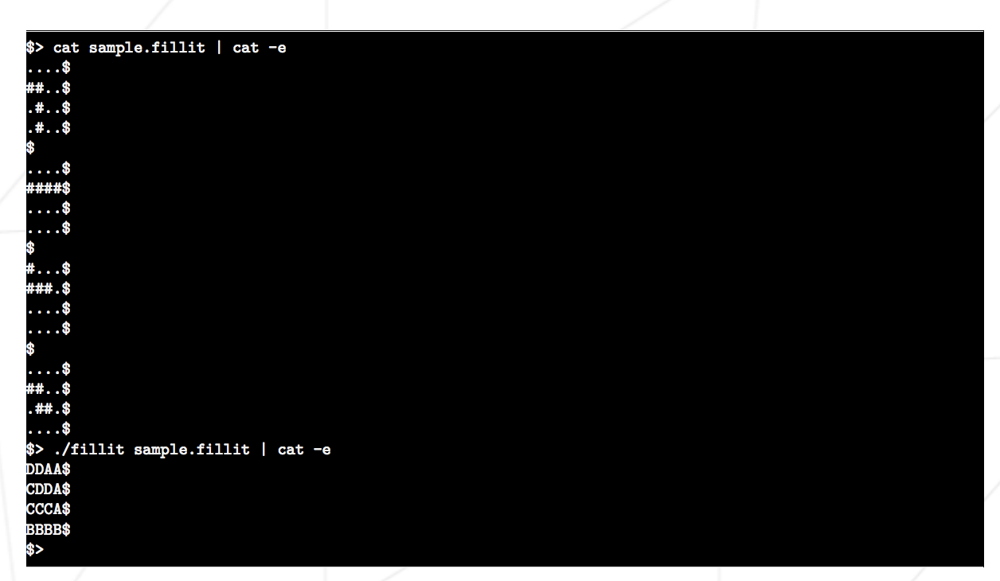
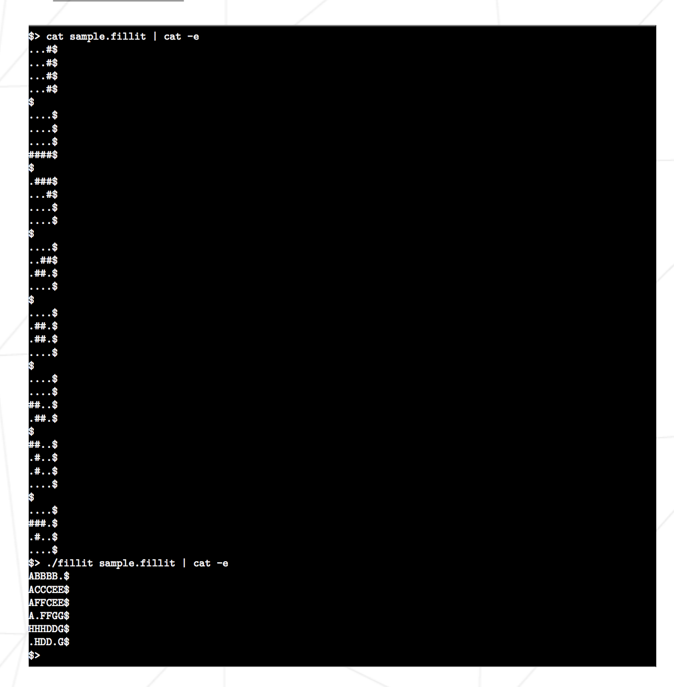

# filler projet qui a pour but de nous familiariser avec le back tracking. 

Dans ce projet, nous recevons via une file descriptor plusieurs pièces de Tetris. 
Nous devrons placer toutes ces pièces dans le plus petit carré possible.
utilisation: 
make
./fillit maps/[nom de la map]

exemple :

